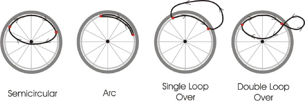

# Wheelchair propulsion stroke detection

Manual wheelchair propulsion encompasses various techniques, each designed to suit the user's preferences, physical condition, and functional abilities. 

### Propulsion Types
The four primary types of manual wheelchair propulsion are as follows:
1. Arc Propulsion
2. Single Loop Propulsion
3. Double Loop Propulsion
4. Semicircular Loop Propulsion  

The propulsion types considered in this classification are primarily Arc (A) and Semi-circular (SC) loop propulsion. The notebook utilizes machine learning techniques to classify wheelchair propulsion based on input data.

### Dataset Description
The dataset used for training and testing the classification model includes samples of wheelchair propulsion labelled with their respective types. Each sample is associated with features extracted from the propulsion motion.
Dataset is not uploaded on github. 

### Features 
1. Mean of 3 axes and resultant
2. Standard deviation of 3 axes and resultant
3. Numbers crossing mean of 3 axes and resultant
4. Numbers crossing mean plus standard deviation of 3 axes and resultant
5. Maximum power spectral density of 3 axes and resultant
6. Peaks of 3 axes and resultant
7. Amplitude difference between peaks for 3 axes and resultant
8. Average push count
9. Label

### Notebook 

This notebook classifies ARC and SEMI-CIRCULAR data samples. 
Notebook contents:

1. Import libraries and load the features
2. Exploratory Data Analysis
3. Feature selection 
4. Model Selection
5. Select the model with highest evaluation metric
6. Save the finalized model

Open the Jupyter notebook (Wheelchair_Propulsion_Classification.ipynb) in a Jupyter environment.

Run the notebook cells sequentially, following the instructions provided.

Input your own data for classification or use the provided sample dataset.
Evaluate the model's performance based on the provided metrics.

### References
1. Image References: Alicia M. Koontz, Bailey M. Roche, Jennifer L. Collinger, Rory A. Cooper, Michael L. Boninger,
Manual Wheelchair Propulsion Patterns on Natural Surfaces During Start-Up Propulsion,
Archives of Physical Medicine and Rehabilitation,
Volume 90, Issue 11,
2009,
Pages 1916-1923,
ISSN 0003-9993,
https://doi.org/10.1016/j.apmr.2009.05.022.
2. Dataset : NYU Grossman School of Medicine; veerua01labspace

### Disclaimer
This dataset and classifier is not intended for diagnostic or clinical use. It is crucial to consult with healthcare professionals and use validated medical data for any medical-related decisions.
